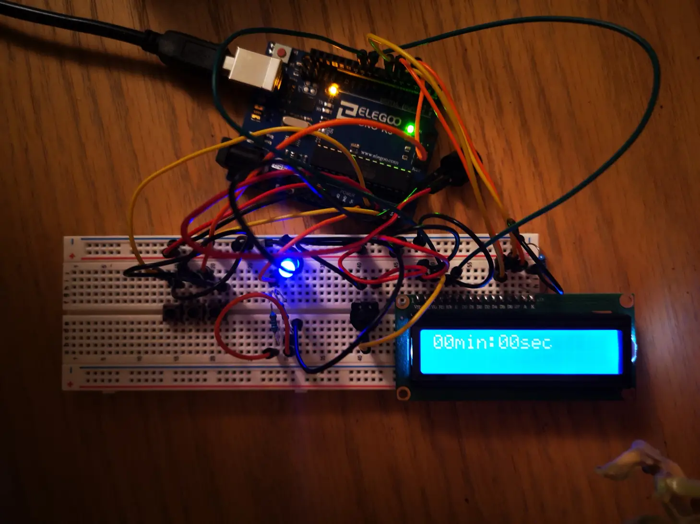
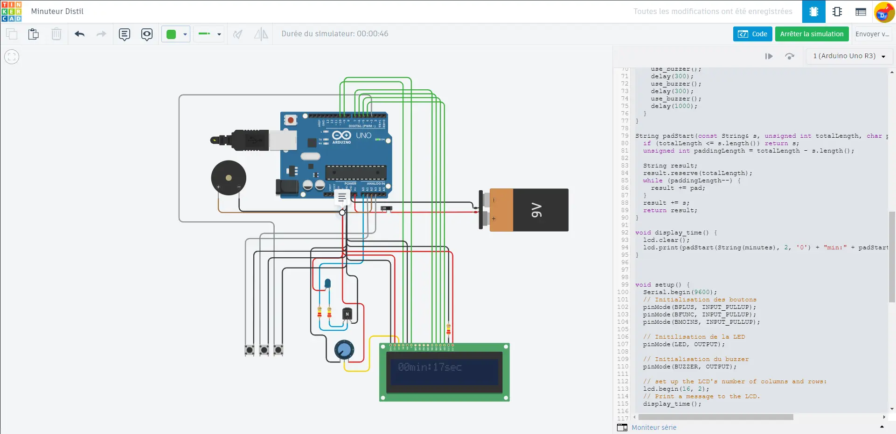

# Minuteur

Dépendance :
- [LiquidCrystal](https://www.arduino.cc/reference/en/libraries/liquidcrystal/) 1.0.7

Tinkercad :
[https://www.tinkercad.com/things/kSU0aUEMXNH-minuteur-distil](https://www.tinkercad.com/things/kSU0aUEMXNH-minuteur-distil)

Photo du prototype :

Capture tinkercad :

